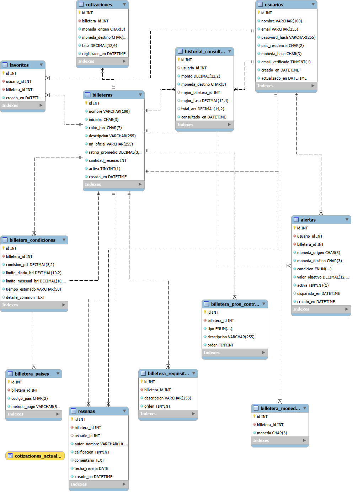

# BrasilPagos

App mobile para usuarios argentinos que viajan a Brasil. Compara cotizaciones ARS→BRL de billeteras virtuales argentinas para pagos vía PIX, mostrando el ranking de mejor a peor tasa en tiempo real.

---

## Arquitectura general

```
┌─────────────────────────────────────────┐
│           App Mobile (Expo)             │
│  React Native 0.81.5 · Expo SDK 54      │
│  Firebase Auth (email + Google)         │
└──────────────┬──────────────────────────┘
               │ HTTP (JWT Bearer)
               ▼
┌─────────────────────────────────────────┐
│           API REST (Express)            │
│  Node.js 22 · Express 4 · Puerto 3000  │
│  JWT stateless · bcryptjs passwords    │
└──────────────┬──────────────────────────┘
               │ mysql2 pool
               ▼
┌─────────────────────────────────────────┐
│           Base de datos MySQL 8         │
│  11 tablas · VIEW cotizaciones_actuales │
│  13 billeteras con datos completos      │
└─────────────────────────────────────────┘
```

### Modelo de datos

```
usuarios
  └── alertas (1:N)
  └── historial_consultas (1:N)
  └── favoritos (1:N)

billeteras  ← MAESTRO principal
  └── billetera_paises (1:N)
  └── billetera_monedas (1:N)
  └── billetera_condiciones (1:1)
  └── billetera_pros_contras (1:N)
  └── billetera_requisitos (1:N)
  └── cotizaciones (1:N)
  └── resenas (1:N)
```

**VIEW `cotizaciones_actuales`:** devuelve la última tasa registrada por billetera ordenada de mejor a peor. La API la consulta directamente para el ranking.

### Flujo de autenticación

La app usa dos sistemas en paralelo:
- **Firebase Auth** — controla acceso a la app (verificación de email)
- **JWT propio** — controla acceso a los endpoints protegidos de la API

```
Login (email/contraseña):
  Firebase login → chequea emailVerified → POST /api/auth/login → JWT → AsyncStorage

Login con Google:
  Firebase Sign-In → POST /api/auth/firebase-login con ID token → JWT → AsyncStorage

App reabierta / token faltante:
  onAuthStateChanged detecta sesión Firebase → restaura JWT desde AsyncStorage
  Si no hay token → POST /api/auth/firebase-login con getIdToken() de Firebase
```

---

## Requisitos previos

| Herramienta | Versión |
|---|---|
| Node.js | 22.x |
| MySQL | 8.x |
| MySQL Workbench | cualquier versión reciente |
| Expo Go (celular) | última versión disponible |

---

## Instalación

### 1. Clonar el proyecto

```bash
git clone <url-del-repo>
cd ComparadorBilleteras
```

### 2. Instalar dependencias de la app

```bash
npm install
```

### 3. Instalar dependencias del servidor

```bash
cd server
npm install
```

### 4. Configurar la base de datos

En MySQL Workbench, ejecutar los scripts en este orden:

```sql
-- 1. Crear estructura (tablas, FK, índices, VIEW)
SOURCE database/brasilpagos_schema.sql;

-- 2. Cargar datos iniciales (13 billeteras completas)
SOURCE database/brasilpagos_datos.sql;
```

### 5. Configurar variables de entorno del servidor

Crear el archivo `server/.env`:

```env
DB_HOST=localhost
DB_USER=root
DB_PASSWORD=tu_password
DB_NAME=brasilpagos
JWT_SECRET=una_clave_secreta_larga
PORT=3000
```

El valor de `JWT_SECRET` también se usa como clave del panel admin (`X-Admin-Key`).

### 6. (Opcional) Firebase Admin SDK

Para habilitar la gestión de usuarios Firebase desde el panel admin, copiar el archivo de credenciales en `server/serviceAccountKey.json`. Se descarga desde Firebase Console → Configuración → Cuentas de servicio → Generar clave privada.

Sin este archivo, el endpoint `/api/auth/firebase-login` usa la API pública de Google como fallback automático.

---

## Ejecución

### Servidor (API REST)

```bash
cd server
node index.js
# API corriendo en http://localhost:3000
# Panel admin en http://localhost:3000/admin
```

### App mobile (Expo Go — red local)

```bash
npx expo start -c
# Escanear el QR con Expo Go desde el celular
```

### App mobile (celular físico por USB — método recomendado)

Este método funciona sin depender del WiFi:

```bash
# 1. Conectar el celular con Depuración USB activada
# 2. Verificar que aparece el dispositivo
adb devices

# 3. Hacer reverse del puerto (repetir si se desconecta el cable)
adb reverse tcp:3000 tcp:3000

# 4. Levantar Metro
npx expo start -c
```

La URL en `src/services/api.js` debe ser `http://localhost:3000` (valor por defecto).

---

## API REST

**Base URL:** `http://localhost:3000`

### Endpoints públicos (sin token)

| Método | Ruta | Descripción |
|---|---|---|
| GET | `/api/cotizaciones?monto=500` | Ranking de billeteras para el monto dado |
| GET | `/api/cotizaciones/historial?billetera_id=1` | Historial de tasas de una billetera (hasta 30 registros) |
| GET | `/api/billeteras` | Listado de billeteras activas |
| GET | `/api/billeteras/:id` | Detalle completo: condiciones, pros/contras, requisitos, países, reseñas |
| POST | `/api/auth/register` | Crear cuenta `{ nombre, email, password }` |
| POST | `/api/auth/login` | Login → devuelve `{ token, usuario }` |
| POST | `/api/auth/firebase-login` | Intercambia Firebase ID token por JWT propio `{ idToken }` |

### Endpoints protegidos (`Authorization: Bearer <token>`)

| Método | Ruta | Descripción |
|---|---|---|
| GET | `/api/auth/me` | Datos del usuario autenticado |
| GET | `/api/alertas` | Alertas del usuario |
| POST | `/api/alertas` | Crear alerta `{ billetera_id, condicion, valor_objetivo }` |
| PATCH | `/api/alertas/:id` | Activar/pausar alerta `{ activa: true/false }` |
| DELETE | `/api/alertas/:id` | Eliminar alerta |
| GET | `/api/historial` | Historial de consultas del usuario |
| POST | `/api/historial` | Guardar consulta `{ monto, moneda_destino, mejor_billetera_id, mejor_tasa, total_ars }` |
| GET | `/api/favoritos` | Billeteras favoritas del usuario |
| POST | `/api/favoritos` | Agregar favorito `{ billetera_id }` |
| DELETE | `/api/favoritos/:billetera_id` | Quitar favorito |
| POST | `/api/resenas` | Crear reseña `{ billetera_id, calificacion, comentario }` — recalcula rating automáticamente |

### Endpoints admin (`X-Admin-Key: <JWT_SECRET>`)

| Método | Ruta | Descripción |
|---|---|---|
| POST | `/api/cotizaciones` | Cargar nuevas tasas `{ tasas: [{ billetera_id, tasa }] }` |
| GET | `/api/admin/stats` | Dashboard: usuarios, billeteras, consultas, alertas |
| GET | `/api/admin/billeteras` | Todas las billeteras sin filtrar `activa` |
| PATCH | `/api/admin/billeteras/:id/toggle` | Mostrar/ocultar billetera en la app |
| PUT | `/api/admin/billeteras/:id/rating` | Actualizar rating `{ rating_promedio, cantidad_resenas }` |
| GET | `/api/admin/usuarios` | Listado de usuarios MySQL |
| POST | `/api/admin/usuarios` | Crear usuario en MySQL + Firebase `{ nombre, email, password }` |
| PUT | `/api/admin/usuarios/:id` | Editar nombre/email (sincroniza Firebase) |
| DELETE | `/api/admin/usuarios/:id` | Eliminar de MySQL y Firebase |
| GET | `/api/admin/firebase-usuarios` | Unión Firebase + MySQL |
| POST | `/api/admin/sincronizar-usuario` | Crear registro MySQL para usuario solo-Firebase |

---

## Pantallas (23 implementadas)

| Módulo | Pantallas |
|---|---|
| Onboarding | SplashScreen, OnboardingScreen, LoadingSplashScreen |
| Auth | LoginScreen, RegisterScreen, EmailVerificationScreen, ForgotPasswordScreen |
| Principal | HomeScreen, ResultsScreen, EmptyResultsScreen, LoadingResultsScreen |
| Billeteras | WalletsScreen, WalletProfileScreen, WalletCompareScreen |
| Alertas | AlertsScreen, CreateAlertScreen, PushNotificationScreen |
| Perfil | ProfileScreen, EditProfileScreen, HistoryScreen, FavoritesScreen, SettingsScreen |
| Global | ErrorScreen |

### Funcionalidades destacadas

- **Ranking en tiempo real** — `HomeScreen` permite ingresar el monto, `ResultsScreen` muestra el ranking animado de billeteras desde la API con el ahorro vs. la peor opción.
- **Gráfico de evolución de tasa** — `WalletProfileScreen` muestra el historial de cotizaciones de cada billetera como gráfico de barras (sin librerías externas).
- **Reseñas reales** — los usuarios pueden leer y dejar reseñas desde `WalletProfileScreen`. Cada reseña actualiza el rating promedio en la BD.
- **Alertas con polling** — `AuthContext` verifica cada 60 segundos si alguna alerta activa del usuario se cumplió, y la pausa automáticamente con una notificación en pantalla.
- **Comparador** — `WalletCompareScreen` permite comparar dos billeteras lado a lado. Se puede acceder desde el directorio o desde la pantalla de resultados (donde pre-carga las dos primeras opciones).
- **Favoritos** — cualquier billetera se puede guardar como favorita; persiste en la BD y se muestra en `FavoritesScreen`.
- **Historial** — cada consulta de cotizaciones se guarda automáticamente y se puede ver en `HistoryScreen` o en las últimas 3 consultas del `HomeScreen`.

---

## Seguridad

- Contraseñas hasheadas con `bcryptjs` (salt 10). Nunca se almacena texto plano.
- JWT firmado con `JWT_SECRET`, expira en 7 días. El middleware `auth.js` lo verifica en cada ruta protegida.
- Firebase Auth requiere email verificado para acceder a la app.
- Panel admin protegido con `X-Admin-Key`.

---

## Panel admin

Accesible en `http://localhost:3000/admin`. Incluye cuatro tabs:

- **Dashboard** — estadísticas generales (usuarios, billeteras activas, consultas del día)
- **Cotizaciones** — carga masiva de tasas para todas las billeteras
- **Billeteras** — toggle visible/oculta, edición de rating
- **Usuarios** — CRUD completo con sincronización Firebase (requiere `serviceAccountKey.json`)

## Modelo Entidad-Relación
